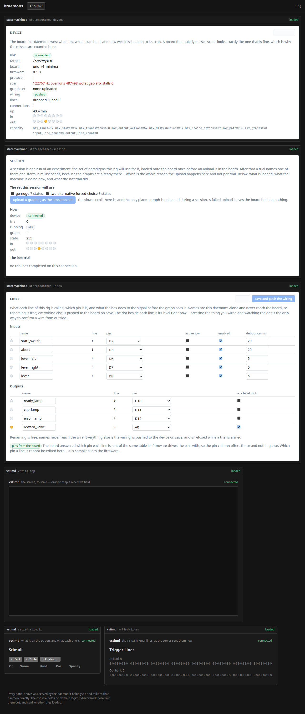

# 02 — a working two-daemon console

Three statemachined panels and three vstimd panels on one page, each served by
its own daemon, against a **real Uno R4 Minima** and a live `vstimd --null`.



Two codebases, two languages, two protocols — statemachined is FastAPI and JSON,
vstimd is axum and protobuf over two WebSockets — and one page that knows neither
of them. The shell (`static/console.js`) never calls a daemon's API and knows no
field name from either protocol.

## What it verifies

- **Six panels from two daemons load and render live data.** statemachined's
  device panel shows the board's real scan rate and pin map; vstimd's show the
  VTL bit grid and the stimulus table.
- **Actuation works through the console.** Clicking `+ Rect` in the embedded
  vstimd panel creates a stimulus on the daemon.
- **Shadow roots hold.** Six panels, no class collisions, no shared framework —
  and the console's stylesheet cannot reach into any of them.
- **A React UI wraps as custom elements in ~40 lines**, with nothing inside the
  panels changed. They were already functions of `(conn, snapshot)`, and their
  inline styles are element-local and so already shadow-DOM-safe.
- **One daemon dying does not take the page down.** With vstimd stopped, its
  panels say `unreachable — retrying` and statemachined's three stay live.
- **An open page recovers on its own.** Restarting vstimd, the panels reconnect
  within ten seconds with no reload.

## What it showed that was wrong

Four findings, all in `../../docs/PLAN.md`:

1. **The daemons cannot be grouped into a rig** (§4). vstimd's `id=` is its
   hostname; statemachined's is `sha256("statemachined:" + machine-id)`. The salt
   is the daemon's own name, so on one box they are two unrelated strings *by
   construction*, and a console grouping on `id=` shows every rig twice. Needs a
   shared `rig=` record. **This is the one thing that must be fixed in the
   daemons.**
2. **vstimd's mDNS record is unusable by a console** (§4): it advertises port
   5555, the ZMQ port, with no `api`, `elements` or web port — and from a
   `.service` template that cannot know the port the server was given.
3. **There is no theming** (§2). Look at the screenshot: statemachined's panels
   are light and vstimd's are dark, and it reads as two applications sharing a
   scrollbar. Shadow roots stop the console's CSS reaching in when it is wanted
   too. Fix: a `--braemons-*` custom-property contract, since custom properties
   inherit *through* shadow boundaries. Agree it while there are two UIs.
4. **"connecting" and "unreachable" have to be different words** (§5). The first
   version of the wrapper knew only connected/not, and with vstimd stopped it sat
   on `connecting…` forever — which reads as *slow* when it means *absent*. Now
   three states and a backoff retry.

A fifth, smaller: panels do not declare a size, so the layout guesses.

## What it fakes

- **vstimd does not serve `/elements/vstimd.js`.** `vstimd-elements/` is a
  prototype of a file that belongs upstream in vstimd; `build.mjs` bundles it
  across the two repos and `serve.mjs` serves it, standing in for the daemon.
  That is the *only* daemon-specific thing in this experiment, and it is exactly
  what it is asking vstimd to take over.
- **Because of that, killing vstimd does not test the import-failure path** —
  the module is served by the console here, so the elements load and then fail to
  connect. The `no elements` branch in `console.js` is written but unexercised.
- **`rigs.json` stands in for mDNS.** `discovery.mjs` really does browse DNS-SD
  and really did find nothing, because neither daemon was advertising on this
  box. The configured path is a first-class path (§3), not only a test fixture.
- **statemachined's session panel polls `/api/trial/result` and gets a 404** when
  no trial has run. Cosmetic, and statemachined's, not the console's.

## Running it

```sh
statemachined serve --port 8081                       # a board, or not
vstimd --null --web-port 8150 --zmq-port 5570

node build.mjs      # bundles vstimd-elements/ (needs ../../../vstimd checked out)
node serve.mjs      # http://127.0.0.1:9000
```

`VSTIMD_WEB_SRC` overrides where vstimd's `client/web` is.

## The files

| | |
|---|---|
| `static/index.html`, `console.js`, `console.css` | the shell — nav, layout, per-daemon status, no domain logic. Zero dependencies |
| `discovery.mjs` | DNS-SD browse via `avahi-browse`, as JSON. The one thing a browser cannot do for itself (§3) |
| `serve.mjs` | static files + `GET /api/rigs`. Speaks to no daemon |
| `vstimd-elements/vstimd_elements.tsx` | the prototype that belongs in vstimd |
| `build.mjs` | esbuild, no config file, no Vite |
| `rigs.json` | configured rigs, for when mDNS cannot answer |
